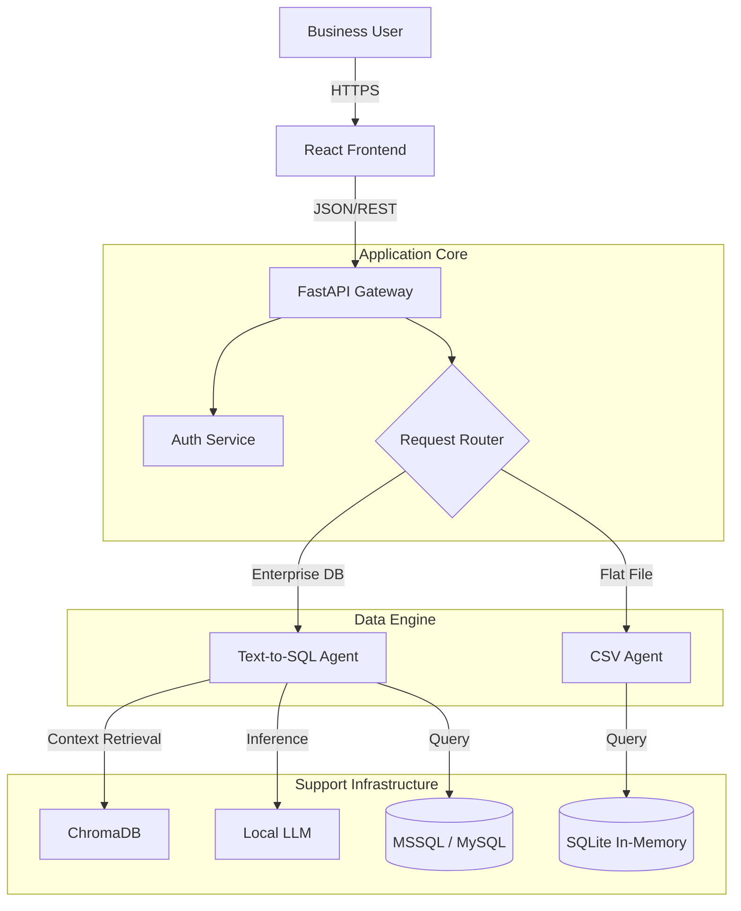

# ParseQRi: Enterprise Data Intelligence Platform

## comprehensive Technical Whitepaper & Product Specification

**Version:** 2.1
**Date:** February 2026
**Confidentiality:** Internal / Client Distribution

---

# Table of Contents

1.  [Executive Summary](#1-executive-summary)
2.  [Product Vision & Scope](#2-product-vision--scope)
    - 2.1 Problem Statement
    - 2.2 The Solution
    - 2.3 Scope of Work
3.  [Use Cases & Industry Applications](#3-use-cases--industry-applications)
4.  [Technology Stack](#4-technology-stack)
5.  [System Architecture](#5-system-architecture)
    - 5.1 High-Level Architecture
    - 5.2 The Dual-Agent Engine
    - 5.3 Text-to-SQL Module (LangGraph)
    - 5.4 CSV Analysis Module (MCP)
6.  [Detailed Workflows](#6-detailed-workflows)
7.  [Frontend & Backend Implementation](#7-frontend--backend-implementation)
8.  [Security & Compliance](#8-security--compliance)
9.  [Deployment & Infrastructure](#9-deployment--infrastructure)

---

# 1. Executive Summary

**ParseQRi** is an enterprise-grade, AI-powered analytics platform designed to democratize data access within organizations. By leveraging advanced Large Language Models (LLMs) deployed on-premise, ParseQRi bridges the gap between complex data silos (SQL Databases, CSV files) and non-technical business decision-makers.

Unlike cloud-native solutions that require sending sensitive financial or operational data to third-party APIs (like OpenAI), ParseQRi operates entirely within the client's infrastructure. It utilizes a **Dual-Agent Architecture**—combining a rigorous **Text-to-SQL engine** for structured enterprise databases with a flexible **CSV Agent** for ad-hoc analysis—to deliver accurate, secure, and instant insights.

This document serves as a comprehensive guide to the platform's capabilities, architecture, and technical implementation, intended for stakeholders ranging from CTOs to Data Compliance Officers.

---

# 2. Product Vision & Scope

## 2.1 Problem Statement

In the modern enterprise, data is abundant but accessibility is scarce.

- **The Bottleneck:** Business leaders rely on a centralized Data Team for every report, creating a backlog of tickets for simple queries (e.g., "What were sales in Q3?").
- **The Shadow IT Risk:** Frustrated users often export data to insecure spreadsheets or upload it to unauthorized cloud AI tools (ChatGPT, Claude) to get answers, risking significant data leaks.
- **The Context Gap:** Generic AI tools lack the deep, semantic understand of an organization's specific database schema and business logic.

## 2.2 The Solution

ParseQRi acts as a **Virtual Data Analyst** that resides securely inside the corporate firewall. It allows users to query their data using natural language, automatically generating the necessary SQL, Python, or Visualization code to answer the question.

**Key Value Propositions:**

1.  **Zero-Trust Privacy:** No data leaves the organization's network.
2.  **Semantic Precision:** The system "learns" the database schema using Vector Search (ChromaDB), ensuring high accuracy.
3.  **Dual-Mode Operation:** Seamlessly handles both rigid, large-scale SQL databases and flexible, ad-hoc CSV uploads.

## 2.3 Scope of Work

### In-Scope Features

- **Enterprise Connectivity:**
  - Native support for Microsoft SQL Server (MSSQL), MySQL, and PostgreSQL.
  - Windows Authentication (Trusted Connection) support.
- **Ad-Hoc Analysis:**
  - Drag-and-drop CSV file ingestion.
  - Pandas-based analysis pipeline for flat files.
- **AI Engine:**
  - Local LLM inference (Ollama) support for Llama 3, Mistral, and Qwen models.
  - LangGraph-based state management for complex SQL generation.
  - Automatic SQL validation and syntax correction.
- **User Experience:**
  - Conversational Chat Interface ("Chat with Data").
  - Interactive Data Visualization (Bar, Line, Pie charts).
  - Transparent SQL Editor for power users.
- **Security:**
  - JWT-based Authentication.
  - Role-Based Access Control (RBAC).

### Out-of-Scope (Current Phase)

- Real-time streaming data ingestion (Kafka/Spark).
- Write/Update operations (The system is strictly Read-Only for safety).
- Automatic ETL pipelines for unstructured data (PDF/Image parsing).

---

# 3. Use Cases & Industry Applications

## 3.1 Financial Services (The CFO Office)

- **Scenario:** A CFO needs to analyze daily liquidity positions across multiple accounts without waiting for the end-of-day IT report.
- **Query:** "Show me the total cash position for all region 'APAC' accounts and compare it to last week."
- **Result:** ParseQRi queries the MSSQL Ledger table, aggregates the data, and generates a trend line graph comparing T vs T-7.

## 3.2 Healthcare (Patient Analytics)

- **Scenario:** A hospital administrator needs to track bed occupancy rates.
- **Constraint:** Patient data (PHI) cannot leave the hospital's on-premise server due to HIPAA compliance.
- **Query:** "List the top 5 departments with the highest average length of stay for Q1."
- **Result:** The local ParseQRi instance processes the query on the internal server. No data is sent to the cloud.

## 3.3 Retail & Supply Chain

- **Scenario:** A regional manager receives a massive CSV dump of inventory data from a legacy system.
- **Query:** "Which SKUs have stock levels below 50 units but high sales velocity in the last 30 days?"
- **Result:** The **CSV Agent** ingests the file, calculates 'sales velocity' (derived metric), and highlights the critical SKUs in a table.

---

# 4. Technology Stack

ParseQRi is built on a modern, scalable, and type-safe stack designed for maintainability and performance.

### Frontend

- **Framework:** **React 18** (Vite build tool)
- **Language:** **TypeScript** (Strict mode for robustness)
- **Styling:** **TailwindCSS** (Utility-first design system)
- **State Management:** React Hooks + Context API
- **Visualization:** **Chart.js** / **React-Chartjs-2**
- **Networking:** Axios with robust interceptors for JWT handling.

### Backend API

- **Framework:** **FastAPI** (Python 3.10+) - Chosen for high-performance async capabilities and auto-generated Swagger documentation.
- **ORM:** **SQLAlchemy** - Manages application state (Users, DB Configs) via SQLite/PostgreSQL.
- **Security:** `Passlib` (Bcrypt) for password hashing, `PyJWT` for token management.

### AI & Data Engine

- **Orchestration:**
  - **LangGraph:** Used for the Text-to-SQL state machine (Supervisor, Generator, Validator, Reflector nodes).
  - **MCP (Modular Capability Provider):** Used to encapsulate the CSV Agent's tools.
- **Inference Server:** **Ollama** (Local API).
  - _Models:_ `qwen2.5-coder` (SQL Generation), `llama3` (Intent/Chat), `mistral` (Summarization).
- **Vector Database:** **ChromaDB** - Stores embeddings of table schemas and column descriptions to enable semantic search (RAG).
- **Caching:** **Redis** - Caches frequent Natural Language queries to reduce inference latency and cost.

---

# 5. System Architecture

## 5.1 High-Level Architecture

The platform follows a **Micro-Service inspired Monolith** architecture. While hosted as a single deployable unit, the internal logic is strictly separated into distinct modules.

## 5.2 The Dual-Agent Engine

A unique feature of ParseQRi is its recognition that querying a structured SQL database requires a different cognitive architecture than analyzing a flat CSV file.

### 5.3 Text-to-SQL Module (LangGraph)

Designed for **Accuracy and Safety**.

1.  **Supervisor**: The "Brain" that manages the conversation state.
2.  **Schema Retriever**: Uses RAG (Retrieval Augmented Generation) to find only the relevant tables for a user's question, preventing context window overflow.
3.  **SQL Generator**: A specialized Coding LLM (Qwen-Coder) that writes the dialect-specific SQL (e.g., T-SQL for MSSQL).
4.  **SQL Validator**: A deterministic code analysis step (using `sqlglot`) that checks for syntax errors and forbidden commands (e.g., `DROP`, `DELETE`).
5.  **Reflector**: If the query fails validation, this agent analyzes the error and "self-corrects" the SQL before showing it to the user.

### 5.4 CSV Analysis Module (MCP)

Designed for **Flexibility**.

1.  **Ingestion**: Files are uploaded to a secure, user-isolated sandbox.
2.  **Loading**: Data is loaded into a high-performance `pandas` DataFrame or a temporary `duckdb`/`sqlite` instance.
3.  **Analysis**: The agent can write and execute Python code to perform complex transformations (e.g., "Pivot this table and calculate the correlation between X and Y") which are impossible in standard SQL.

---

# 6. Detailed Workflows

## Workflow A: Connecting & Querying a Database

1.  **Connection**:
    - User navigates to "Data Sources".
    - Enters "Server Name", "DB Name", and selects "Windows Auth".
    - Backend validates connection via `pyodbc`.
2.  **Indexing (The "Learning" Phase)**:
    - The system scans the database information schema.
    - It extracts table names, column names, and comments.
    - These are embedded and stored in ChromaDB.
3.  **The Query**:
    - User asks: _"Find customers in Tokyo."_
    - **Intent Agent**: Classifies as `Data Retrieval`.
    - **retriever**: Searches ChromaDB for "customer", "address", "city". Returns `SalesLT.Customer` and `SalesLT.Address`.
    - **Generator**: Writes `SELECT * FROM SalesLT.Customer JOIN ... WHERE City = 'Tokyo'`.
    - **Executor**: Runs query on MSSQL.
    - **Visualizer**: Sees 50 rows, decides to show a `Table`.

## Workflow B: CSV Analysis

1.  **Upload**:
    - User drags `Q3_Sales.csv` into the chat window.
    - File is hashed and stored in `uploads/csv_tmp/{user_id}/`.
2.  **Analysis**:
    - User asks: _"Plot the monthly revenue trend."_
    - **CSV Agent**:
      - Loads CSV.
      - Identifies 'Date' and 'Revenue' columns.
      - Resamples data by Month.
      - Generates JSON data specifically formatted for Chart.js (`labels: ['Jan', 'Feb'], datasets: [...]`).
3.  **Render**:
    - Frontend detects `chart_type: 'line'` and renders the visualization in the chat stream.

---

# 7. Frontend & Backend Implementation

## Frontend Implementation details

The React application is structured around a **Service Layer Architecture**.

- `services/api.ts`: Centralizes all HTTP requests. Includes automatic token refresh logic (interceptors) to handle session expiration gracefully without logging the user out.
- `services/csvAgent.ts`: Specialized methods for the distinct CSV API endpoints.
- `components/visualizations`: Reusable Chart.js wrappers that can dynamically switch between Bar, Line, Pie, and Polar Area charts based on data shape.

## Backend Implementation Details

The Python backend uses **Pydantic** for rigorous data validation.

- **Dependency Injection**: Database sessions and Current User objects are injected into routes using FastAPI's `Depends`.
- **Module Isolation**: To prevent conflicts between the complex libraries used by different agents, specific modules are dynamically loaded (using `importlib`) only when their specific endpoints are called.

---

# 8. Security & Compliance

ParseQRi is architected with a **"Security First"** mindset, appropriate for regulated industries.

1.  **Data Sovereignty**:
    - No external API calls are made for inference. All weights run on local GPUs/CPUs.
2.  **SQL Injection Protection**:
    - The **SQL Validator** agent parses the Abstract Syntax Tree (AST) of every generated query.
    - It strictly blocks any Data Manipulation Language (DML) or Data Definition Language (DDL) commands. Only `SELECT` statements are permitted.
3.  **Authentication**:
    - Standard JWT (JSON Web Token) flow with access/refresh token rotation.
    - Passwords are salted and hashed using `bcrypt` before storage.
4.  **Least Privilege**:
    - Database connections use standard service accounts. The application can only access data that the service account is permitted to see in the target database.

---

# 9. Deployment & Infrastructure

## Recommended Hardware (On-Premise)

Running Local LLMs requires sufficient compute resources.

- **CPU**: 16+ Cores (Modern AMD EPYC or Intel Xeon).
- **RAM**: 64GB+ (to hold model weights and vector indices in memory).
- **GPU**: NVIDIA A100 / A10G / RTX 4090 (24GB+ VRAM) is **highly recommended** for low-latency inference.
- **Storage**: NVMe SSD (fast storage is critical for Vector Search performance).

## Containerization

The entire application is containerized using Docker.

- `frontend`: Nginx serving static React build.
- `backend`: Uvicorn/Gunicorn running FastAPI.
- `redis`: Caching layer.
- `db`: PostgreSQL container for application metadata (optional, can use external DB).
- `ollama`: LLM Inference server.

---

_This document constitutes the technical specification for ParseQRi v2.1. For further details on API implementation, please refer to the specific API documentation files._
