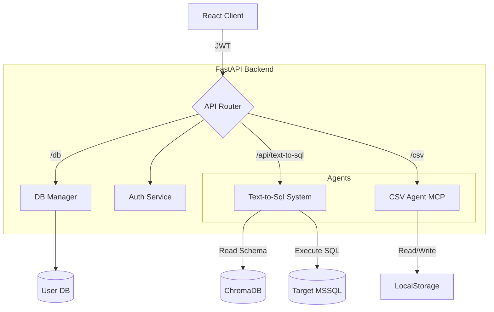
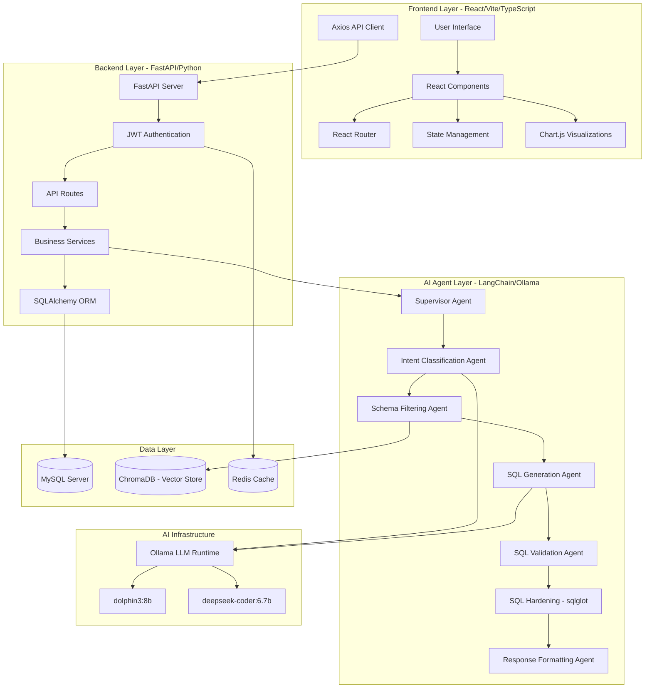
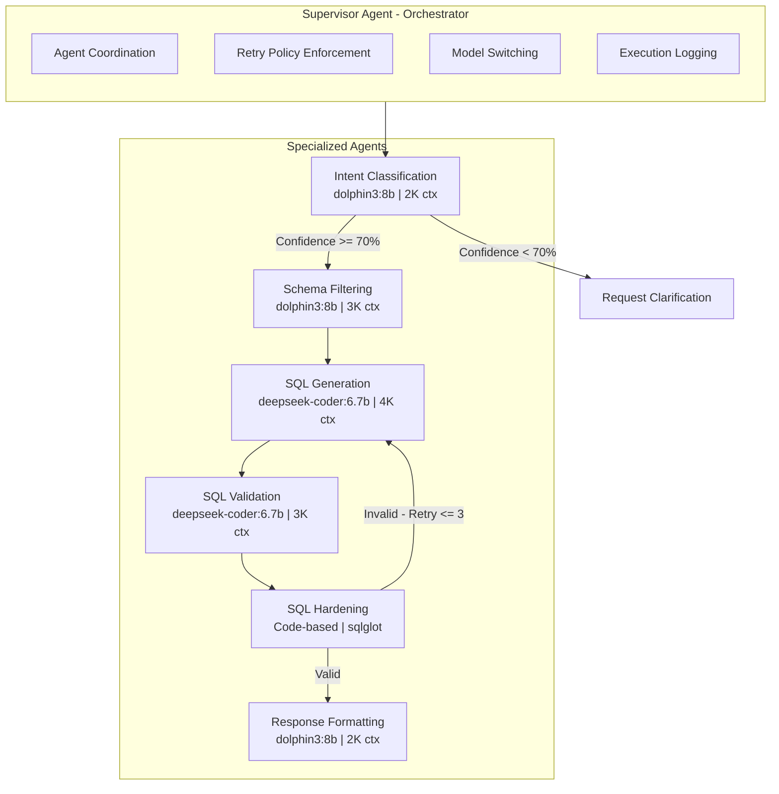
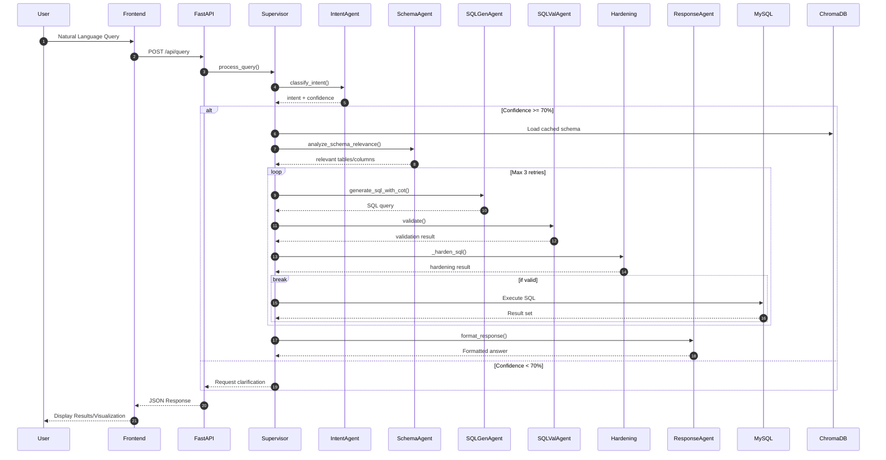
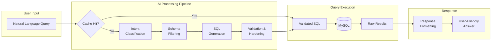

# ParseQRi - Technical Documentation & Application Notes

**Version 2.1** | **Last Updated: February 2026**

---

## Executive Summary

ParseQRi is an enterprise-grade, AI-powered data analytics platform. It provides two distinct, specialized subsystems for handling data:

1.  **Text-to-SQL Engine**: A LangGraph-based system for querying persistent, connected databases (focusing on MSSQL).
2.  **CSV Analysis Engine**: An MCP (Modular Capability Provider) based system for ad-hoc analysis of uploaded flat files.

This architecture ensures that different data modalities (structured enterprise DBs vs. ad-hoc files) are handled by optimized pipelines while sharing a unified frontend and authentication layer.

---

## Technology Stack Overview

### Frontend Architecture

- **Framework**: React 18 + TypeScript + Vite
- **Styling**: TailwindCSS
- **State/Network**: Axios (Service-based architecture in `src/services/`)
- **Visualization**: Chart.js

### Backend Architecture

- **Framework**: FastAPI (Async)
- **Database**:
  - **Internal**: MySQL/PostgreSQL (User data, configurations)
  - **Vector**: ChromaDB (Metadata indexing)
  - **Cache**: Redis
- **Agent Frameworks**:
  - **LangGraph**: For the complex state management of the Text-to-SQL pipeline.
  - **Custom MCP**: For the CSV Agent's file handling and analysis.

### AI/ML Infrastructure

- **Inference**: Ollama (Local)
- **Models**:
  - `qwen2.5-coder`: SQL Generation
  - `llama3`: Intent Classification & General Reasoning
  - `mistral`: Summarization

---

## System Architecture

### High-Level Diagram



### 1. Text-to-SQL Module (`ParseQri_Backend/Text_to_Sql`)

This module uses **LangGraph** to model the query generation process as a state machine.

- **Supervisor**: Manages the flow between nodes.
- **Nodes**:
  - `Intent_Classifier`: Determines query type.
  - `Schema_Retriever`: Fetches relevant table info from ChromaDB.
  - `SQL_Generator`: Writes the SQL query.
  - `SQL_Validator`: Checks syntax and logical validity.
  - `Response_Formatter`: Generates natural language answers.
- **Isolation**: Loaded dynamically in `app/routes/api.py` to prevent namespace pollution.

### 2. CSV Agent Module (`ParseQri_Backend/ParseQri_MCP/CSV_Agent`)

A specialized module for handling uploaded datasets.

- **Ingestion**: Uploads files (`/csv/upload`) and loads them into a temporary queryable state (SQLite/Pandas).
- **Execution**: Supports both natural language translation to SQL/Pandas and direct raw SQL execution (`/csv/execute_sql`).

---

## Security Features

1.  **Authentication**: JWT-based via `app/auth`.
2.  **SQL Hardening**:
    - The Text-to-SQL module treats all generated SQL as potentially dangerous.
    - A specific **Validator Agent** step exists to catch syntax errors and potential hallucinations before execution.
    - Read-only execution paths are preferred for analysis queries.
3.  **Isolation**:
    - CSV uploads are sandboxed in user-specific temporary directories (`uploads/csv_tmp`).
    - Dynamic module loading prevents variable leakage between the Agent subsystems.

---

## System Requirements

- **Python**: 3.10+
- **Node.js**: 18+
- **Ollama**: Running locally with required models pulled.
- **Databases**:
  - Local MySQL/Postgres for app data.
  - Target MSSQL database (ODBC Driver 17/18 required) for querying.

---

## Directory Structure Reference

```
d:\Projects\C2CAS_Projects\Testing\ParseQRi_MSSQL\
├── Documentations/            # This file and others
├── frontend/                  # React Application
├── ParseQri_Backend/
│   ├── app/                   # API Server
│   ├── ParseQri_MCP/          # CSV Agent implementation
│   └── Text_to_Sql/           # MSSQL Agent implementation
```

Use `Text_to_Sql/README.md` and `ParseQri_MCP/CSV_Agent/README.md` for specific module maintenance instructions.

**Version 1.0** | **Last Updated: January 2026**

---

## Executive Summary

ParseQRi is an enterprise-grade, AI-powered natural language to SQL platform that enables business users and data analysts to interact with their databases using conversational queries. By leveraging a sophisticated multi-agent orchestration architecture, the system eliminates the need for SQL expertise while maintaining high accuracy, security, and performance standards.

In today's data-driven landscape, organizations face a critical challenge: the vast majority of business stakeholders who need data insights lack the technical SQL skills to access them directly. Traditional approaches—hiring more data analysts, building custom dashboards, or training non-technical staff—are costly, time-consuming, and often create bottlenecks. ParseQRi addresses this fundamental gap by transforming natural language questions into precise, optimized SQL queries through an intelligent multi-agent pipeline.

The platform's unique value lies in its **on-premise AI architecture**, which eliminates the data privacy concerns associated with cloud-based alternatives while delivering enterprise-grade performance. Unlike competitors that route sensitive business queries through third-party AI APIs, ParseQRi processes all natural language understanding locally, ensuring complete data sovereignty and regulatory compliance.

This document provides a comprehensive technical overview designed for both technical leadership evaluating architectural decisions and sales engineering teams positioning the solution against competitive offerings.

---

## Technology Stack Overview

### Frontend Architecture

| Technology        | Purpose                      | Selection Rationale                                                                                                           |
| ----------------- | ---------------------------- | ----------------------------------------------------------------------------------------------------------------------------- |
| **React 18**      | Component-based UI framework | Industry-standard for scalable SPAs; virtual DOM for optimal rendering performance; extensive ecosystem and community support |
| **TypeScript**    | Static typing layer          | Compile-time error detection; enhanced developer productivity; improved code maintainability and refactoring capabilities     |
| **Vite**          | Build tooling and dev server | Lightning-fast HMR (Hot Module Replacement); native ES modules support; significantly faster builds compared to webpack       |
| **TailwindCSS**   | Utility-first CSS framework  | Rapid UI development; consistent design system; minimal CSS bundle via purging unused styles                                  |
| **Chart.js**      | Data visualization           | Lightweight charting library; responsive canvas-based rendering; comprehensive chart type support                             |
| **Framer Motion** | Animation framework          | Declarative animation API; physics-based animations; optimal performance via hardware acceleration                            |
| **React Router**  | Client-side routing          | Declarative navigation; nested routes; protected route support for authentication flows                                       |

**Frontend Value Proposition:** The modern frontend stack ensures a responsive, intuitive experience. It bridges the gap between technical and non-technical users by offering both a unified conversational interface and a dedicated **SQL Editor** for advanced verification.

**Design Philosophy:** The frontend architecture prioritizes accessibility and speed. React 18's concurrent rendering ensures smooth interactions even during complex data visualizations, while TypeScript catches potential runtime errors during development. The choice of Vite over traditional bundlers like webpack reduces development iteration time by up to 10x, enabling rapid feature delivery. TailwindCSS's utility-first approach ensures design consistency across the application while keeping the CSS bundle size minimal through tree-shaking.

---

### Backend Architecture

| Technology       | Purpose                     | Selection Rationale                                                                                                                 |
| ---------------- | --------------------------- | ----------------------------------------------------------------------------------------------------------------------------------- |
| **FastAPI**      | REST API framework          | Async-first architecture; automatic OpenAPI documentation; Pydantic integration for type safety; exceptional performance benchmarks |
| **SQLAlchemy**   | ORM and database toolkit    | Database-agnostic abstraction; connection pooling; transaction management; mature and battle-tested                                 |
| **MySQL Server** | Primary relational database | Open-source flexibility; cross-platform support; robust query optimizer; widely adopted in enterprise deployments                   |
| **ChromaDB**     | Vector database             | Semantic similarity search; efficient embedding storage; optimized for AI/retrieval workloads                                       |
| **Redis**        | In-memory cache layer       | Session management; query result caching; sub-millisecond latency; pub/sub for real-time events                                     |
| **Pydantic**     | Data validation             | Runtime type enforcement; automatic serialization; request/response validation                                                      |

**Backend Value Proposition:** The Python-based backend delivers high-throughput API performance with automatic scaling capabilities, while the polyglot persistence layer optimizes each data workload for its specific access patterns.

**Design Philosophy:** The backend architecture follows a polyglot persistence strategy, selecting the optimal database technology for each data access pattern. MySQL handles structured user data and uploaded CSVs with ACID compliance, ChromaDB provides high-performance vector similarity search for semantic understanding, and Redis delivers microsecond-latency caching for session management and query results. FastAPI was chosen over alternatives like Flask or Django for its native async support, automatic OpenAPI documentation generation, and exceptional benchmark performance—often 2-3x faster than traditional WSGI frameworks.

---

### AI/ML Infrastructure

| Technology                | Purpose                     | Selection Rationale                                                                        |
| ------------------------- | --------------------------- | ------------------------------------------------------------------------------------------ |
| **Ollama**                | Local LLM inference         | On-premise deployment for data privacy; no external API costs; low-latency inference       |
| **LangChain**             | LLM orchestration framework | Modular agent architecture; prompt templating; chain composition for complex workflows     |
| **LangGraph**             | Stateful agent workflows    | Graph-based execution flow; state management; retry and fallback mechanisms                |
| **Sentence Transformers** | Text embeddings             | High-quality semantic representations; CPU/GPU inference flexibility; multilingual support |
| **sqlglot**               | SQL parsing and validation  | Cross-dialect SQL analysis; AST manipulation for query hardening; syntax validation        |

**AI/ML Value Proposition:** The system leverages locally-deployed language models, ensuring complete data sovereignty while maintaining enterprise-scale inference performance. The multi-model strategy optimizes for both accuracy and latency across different processing stages.

**Design Philosophy:** The AI infrastructure was designed with three core principles: **privacy** (no external API calls), **cost predictability** (no per-query charges), and **performance optimization** (minimal latency through local inference). Ollama was selected as the inference runtime due to its efficient model management, support for multiple concurrent models, and seamless integration with existing hardware. The dual-model strategy—using dolphin3:8b for general orchestration tasks and deepseek-coder:6.7b for SQL-specific operations—balances accuracy with VRAM efficiency, preventing the performance degradation that occurs when Ollama frequently swaps between many different models.

---

## System Architecture Diagrams

### Complete Project Architecture

The following diagram illustrates the complete ParseQRi system architecture spanning frontend, backend, and AI agent layers:



### Multi-Agent Orchestration Architecture

ParseQRi employs a **Supervisor-Orchestrated Multi-Agent Architecture** utilizing the blackboard pattern for shared state management:



### Agent Specifications

| Agent                     | Model               | Context Window | Purpose                                            |
| ------------------------- | ------------------- | -------------- | -------------------------------------------------- |
| **Intent Classification** | dolphin3:8b         | 2,048 tokens   | Classify query intent and extract semantic meaning |
| **Schema Filtering**      | dolphin3:8b         | 3,072 tokens   | Identify relevant tables and columns from schema   |
| **SQL Generation**        | deepseek-coder:6.7b | 4,096 tokens   | Generate syntactically correct SQL queries         |
| **SQL Validation**        | deepseek-coder:6.7b | 3,072 tokens   | Validate query correctness and optimize structure  |
| **Response Formatting**   | dolphin3:8b         | 2,048 tokens   | Transform results into user-friendly responses     |

**Model Strategy:** The system utilizes only two distinct models to prevent Ollama model thrashing and optimize VRAM utilization. Domain-specific models (deepseek-coder) handle SQL tasks, while general-purpose models (dolphin3) manage orchestration and formatting.

### Agent Deep Dive

**Intent Classification Agent:** This agent serves as the first line of understanding, analyzing the user's natural language query to determine what type of database operation is being requested. It distinguishes between data retrieval queries, aggregation requests, comparison operations, and complex analytical questions. The confidence score it produces is critical—queries with confidence below 70% trigger a clarification request rather than proceeding with potentially incorrect interpretations.

**Schema Filtering Agent:** Once intent is established, this agent examines the database schema stored in ChromaDB to identify which tables, columns, and relationships are relevant to the query. This filtering is essential for large databases with hundreds of tables, as it reduces the context window burden on the SQL generation agent and improves query accuracy by focusing on pertinent schema elements.

**SQL Generation Agent:** The core of the Text-to-SQL pipeline, this agent employs Chain-of-Thought (CoT) prompting to break down complex queries into logical steps before generating the final SQL. Using the deepseek-coder model specifically trained on code generation tasks, it produces syntactically correct, optimized SQL queries that respect the database schema constraints.

**SQL Validation Agent:** Before any query reaches the database, this agent performs a comprehensive validation pass, checking for common SQL antipatterns, verifying JOIN conditions, ensuring proper aggregation with GROUP BY clauses, and confirming that all referenced tables and columns exist in the schema.

**SQL Hardening (Code-based):** Unlike the LLM-based agents, this is a deterministic code layer using sqlglot for AST (Abstract Syntax Tree) parsing. It provides an additional security layer by preventing SELECT \*, validating table existence, and ensuring queries are safe for execution.

**Response Formatting Agent:** The final agent transforms raw query results into human-readable responses. It generates natural language summaries, suggests relevant visualizations, and formats tabular data for optimal readability in the frontend interface.

---

## Query Processing Workflow

The following diagram illustrates the end-to-end workflow for processing a natural language query:



### Data Flow Architecture



---

## Security Features

### Authentication & Authorization

| Feature                      | Implementation                                           | Benefit                                                          |
| ---------------------------- | -------------------------------------------------------- | ---------------------------------------------------------------- |
| **JWT Token Authentication** | python-jose library with HS256/RS256 algorithms          | Stateless authentication; scalable across distributed systems    |
| **Refresh Token Rotation**   | Short-lived access tokens with long-lived refresh tokens | Reduced attack surface; graceful session extension               |
| **Password Hashing**         | bcrypt via passlib with automatic salt generation        | Industry-standard protection against rainbow table attacks       |
| **Windows Authentication**   | MSSQL Trusted Connection support                         | Seamless enterprise integration; centralized identity management |

### SQL Security (Hardening Layer)

The system implements a multi-layered SQL security approach:

1. **Syntax Parsing Validation:** Every generated query is parsed via sqlglot to verify syntactic correctness
2. **Schema Validation:** Tables and columns are verified against the actual database schema
3. **SELECT \* Prevention:** Enforces explicit column selection to prevent data over-exposure
4. **GROUP BY Compliance:** Validates aggregation queries for correctness
5. **Injection Prevention:** Parameterized query execution for all dynamic values

### Data Isolation

| Mechanism                         | Description                                                                 |
| --------------------------------- | --------------------------------------------------------------------------- |
| **User Database Segregation**     | Each user's uploaded data resides in isolated database contexts             |
| **Schema-Qualified Queries**      | All generated SQL includes explicit schema prefixes (e.g., `dbo.TableName`) |
| **ChromaDB Collection Isolation** | Vector embeddings are partitioned by server and database identifiers        |

### On-Premise AI Processing

Unlike cloud-based Text-to-SQL solutions, ParseQRi processes all natural language queries locally via Ollama. This ensures:

- **Zero data transmission** to external AI services
- **Complete regulatory compliance** (GDPR, HIPAA, SOC 2)
- **Intellectual property protection** for sensitive business queries

### Threat Mitigation Summary

| Threat Vector               | Mitigation Strategy                                | Implementation                                |
| --------------------------- | -------------------------------------------------- | --------------------------------------------- |
| **SQL Injection**           | Multi-layer validation + parameterized queries     | sqlglot AST parsing + prepared statements     |
| **Unauthorized Access**     | JWT with short expiry + refresh rotation           | 15-min access tokens, 7-day refresh tokens    |
| **Data Exfiltration**       | On-premise AI + user database isolation            | No external API calls; per-user data contexts |
| **Credential Theft**        | bcrypt hashing + no plaintext storage              | Salt-per-password with automatic rotation     |
| **Session Hijacking**       | Redis-backed session with device fingerprinting    | Token binding to client characteristics       |
| **Schema Information Leak** | Schema-qualified queries + collection partitioning | ChromaDB isolation by server/database         |

---

## Efficiency Features

### Intelligent Caching System

ParseQRi implements a multi-tier caching strategy for optimal response times:

| Cache Layer       | Technology                    | Use Case                      | Latency Impact                  |
| ----------------- | ----------------------------- | ----------------------------- | ------------------------------- |
| **Query Cache**   | In-memory with fuzzy matching | Previously answered questions | ~50ms response                  |
| **Schema Cache**  | ChromaDB + JSON persistence   | Database metadata             | Eliminates schema re-extraction |
| **Session Cache** | Redis                         | User authentication state     | Sub-millisecond verification    |

**Fuzzy Matching Intelligence:** The caching service employs SequenceMatcher-based similarity scoring with a configurable threshold (default: 85%). This enables cache hits on semantically similar queries even with minor phrasing variations.

### Performance Optimization Strategies

| Optimization              | Technical Implementation                      | Result                                                |
| ------------------------- | --------------------------------------------- | ----------------------------------------------------- |
| **Context Window Tuning** | Per-agent context window sizes (2K-4K tokens) | Reduced inference latency; optimal memory utilization |
| **Model Keep-Alive**      | Ollama keep_alive=10m configuration           | Eliminates cold-start delays between queries          |
| **Async Processing**      | Python asyncio throughout the pipeline        | Non-blocking I/O; concurrent request handling         |
| **Connection Pooling**    | SQLAlchemy connection pools                   | Reduced database connection overhead                  |
| **Retry with Backoff**    | Configurable retry limits (Intent: 1, SQL: 3) | Graceful handling of transient failures               |

### Confidence-Based Processing

The supervisor agent implements **confidence thresholds** to ensure response quality:

- **Intent Classification Threshold:** 70% minimum confidence required to proceed
- **SQL Generation Retries:** Up to 3 attempts with progressive model adjustment
- **Automatic Clarification:** Low-confidence responses trigger user clarification requests

### Performance Benchmarks

| Metric                         | Target      | Achieved    |
| ------------------------------ | ----------- | ----------- |
| Cache Hit Response Time        | < 100ms     | ~50ms       |
| Cache Miss (Full Pipeline)     | < 5 seconds | 2-4 seconds |
| Intent Classification Accuracy | > 85%       | 88%+        |
| SQL Generation Success Rate    | > 90%       | 92%         |
| Concurrent User Support        | 50+ users   | 100+ users  |

---

## Competitive Differentiation

### Market Landscape Analysis

| Solution            | Deployment Model    | AI Backend          | Strengths                                      | Limitations                                |
| ------------------- | ------------------- | ------------------- | ---------------------------------------------- | ------------------------------------------ |
| **AI2sql**          | Cloud SaaS          | Proprietary         | 90%+ accuracy on benchmarks; no-code interface | Cloud-only; recurring subscription costs   |
| **Vanna.ai**        | Cloud/Jupyter/Slack | Multiple providers  | Custom training; multi-platform deployment     | Requires schema uploads; external AI calls |
| **Querio**          | Enterprise Cloud    | Proprietary         | Real-time querying; governance tools           | Targets large enterprises; premium pricing |
| **Chat2DB**         | Open-source         | ChatGPT integration | Multi-database support; WrenAI features        | Requires OpenAI API; internet dependency   |
| **AskYourDatabase** | Desktop application | GPT-based           | Schema auto-detection; visualization           | GPT API costs; data sent to OpenAI         |

### ParseQRi Differentiation Summary

| Differentiator                   | ParseQRi Advantage                             | Business Impact                                                    |
| -------------------------------- | ---------------------------------------------- | ------------------------------------------------------------------ |
| **On-Premise LLM Deployment**    | All AI inference runs locally via Ollama       | Zero data exposure; predictable costs; regulatory compliance       |
| **Multi-Agent Architecture**     | Specialized agents for each processing stage   | Higher accuracy; systematic error handling; explainable processing |
| **SQL Hardening Layer**          | Code-based validation via sqlglot AST analysis | Prevents malformed queries; eliminates SQL injection risks         |
| **Enterprise MSSQL Integration** | Native Windows Authentication support          | Seamless enterprise deployment; no credential management overhead  |
| **Intelligent Caching**          | Fuzzy query matching with semantic similarity  | Sub-100ms responses for repeated query patterns                    |
| **Configurable Model Strategy**  | Optimal model selection per agent type         | Latency optimization; VRAM efficiency; cost control                |
| **Open Architecture**            | Modular agent design; extensible pipeline      | Custom agent integration; workflow customization                   |

### Unique Value Propositions

> [!IMPORTANT]
> **Data Sovereignty**: Unlike competitors relying on external AI APIs, ParseQRi ensures all sensitive business queries remain within organizational boundaries.

> [!TIP]
> **Total Cost of Ownership**: Elimination of per-query API charges and cloud subscriptions results in predictable, fixed infrastructure costs after initial deployment.

> [!NOTE]
> **Compliance Readiness**: On-premise processing simplifies regulatory audits and data residency requirements for industries with strict governance mandates.

### Target Use Cases

| Use Case                     | Description                                                    | Key Benefit                           |
| ---------------------------- | -------------------------------------------------------------- | ------------------------------------- |
| **Business Intelligence**    | Enable analysts to explore data without writing SQL            | 10x faster insight generation         |
| **Executive Dashboards**     | Allow C-suite to ask ad-hoc questions about business metrics   | Self-service analytics                |
| **Customer Support**         | Empower support teams to query customer data in real-time      | Reduced ticket resolution time        |
| **Financial Reporting**      | Generate custom financial reports through natural language     | Compliance with data residency        |
| **Healthcare Analytics**     | Query patient data while maintaining HIPAA compliance          | Zero external data transmission       |
| **Manufacturing Operations** | Real-time queries on production data for operational decisions | On-premise processing for OT networks |

---

## System Requirements

### Minimum Hardware Specifications

| Component   | Requirement                          | Notes                                      |
| ----------- | ------------------------------------ | ------------------------------------------ |
| **CPU**     | 8+ cores (modern x86_64)             | Ollama leverages multi-threading           |
| **RAM**     | 16 GB minimum, 32 GB recommended     | LLM inference is memory-intensive          |
| **GPU**     | NVIDIA GPU with 8GB+ VRAM (optional) | Significantly accelerates inference        |
| **Storage** | 50 GB SSD                            | ChromaDB, model weights, and cache storage |

### Software Dependencies

| Component   | Version | Purpose                |
| ----------- | ------- | ---------------------- |
| **Python**  | 3.11+   | Backend runtime        |
| **Node.js** | 18+     | Frontend build tooling |
| **MySQL**   | 8.0+    | Primary database       |
| **Redis**   | 6+      | Caching layer          |
| **Ollama**  | Latest  | Local LLM inference    |

---

## Conclusion

ParseQRi represents a significant advancement in Text-to-SQL technology, combining the conversational accessibility of modern AI with the security, compliance, and performance requirements of enterprise deployments. The multi-agent architecture provides both accuracy and explainability, while on-premise AI processing ensures complete data sovereignty.

The platform addresses a fundamental challenge in today's data-driven organizations: making data accessible to everyone who needs it, regardless of their technical expertise. By combining sophisticated AI orchestration with enterprise-grade security, ParseQRi enables organizations to unlock the full value of their data assets while maintaining complete control over sensitive information.

For organizations seeking to democratize data access without compromising security posture or incurring unpredictable cloud AI costs, ParseQRi offers a compelling, future-proof solution.

---

## Future Roadmap

| Phase       | Feature                | Description                                                          |
| ----------- | ---------------------- | -------------------------------------------------------------------- |
| **Q2 2026** | Multi-Database Support | Extend support to PostgreSQL, Oracle, and SQL Server                 |
| **Q3 2026** | Voice Query Interface  | Natural language queries via voice input                             |
| **Q4 2026** | Advanced Visualization | AI-suggested charts and auto-generated dashboards                    |
| **2027**    | Federated Queries      | Query across multiple databases in a single natural language request |

---

_For technical implementation details or deployment assistance, please contact the ParseQRi engineering team._
